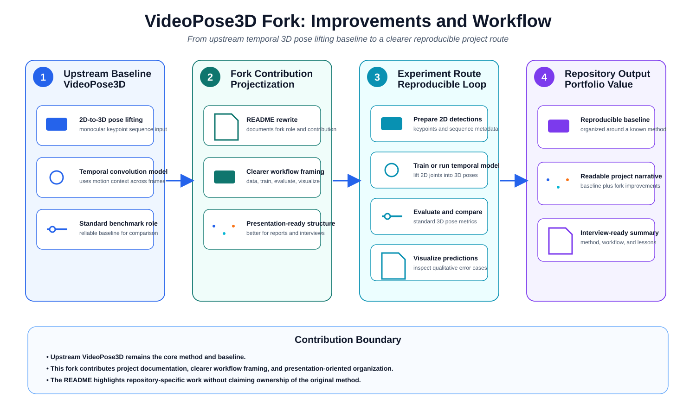

# VideoPose3D Personal Improvement Route

<p align="center">
  
</p>

## Project Position

This repository is my **personal research-and-engineering fork** of **VideoPose3D**, a classic baseline for **monocular 3D human pose estimation**.

The original VideoPose3D project already provides a strong temporal model for lifting 2D keypoint sequences into 3D human joints. My work in this fork is **not to claim the original method as my own**, but to build a version that is easier to understand, reproduce, present, and extend in my own research workflow.

So this README is written with a different goal from the upstream repository: it focuses on **what I improved, what I contributed, and how I used the project in practice**.

## What the Original VideoPose3D Provides

The upstream VideoPose3D project is important because it established a very strong and influential baseline for video-based 3D pose lifting:

- input: 2D joint trajectories,
- model: temporal convolutional pose-lifting network,
- output: 3D joint predictions,
- evaluation: standard 3D human pose metrics on benchmark datasets.

That baseline is exactly why I chose it as a personal project foundation. It is academically meaningful, practically useful, and easy to explain in interviews when the project is presented clearly.

## Why I Built This Fork

When I studied the original repository, I found that the codebase was strong as a research release, but the entry points and explanation style were still closer to a paper implementation than to a polished personal project.

My goal in this fork was therefore to turn it into a **cleaner personal baseline** that better supports:

- reproduction,
- experiment organization,
- result interpretation,
- project presentation,
- later improvement work.

In other words, this fork is not just a copy of the original repository. It is my own **structured study and improvement route** around monocular 3D human pose estimation.

## My Main Contributions

Compared with the original repository, the focus of my contribution in this fork is on **engineering clarity, reproducibility, and projectization**.

### 1. Reframed the repository as a personal research project

Instead of treating the code as a black-box baseline, I reorganized my understanding of the full pipeline:

- what the task really is,
- how 2D detections enter the model,
- how temporal information is used,
- how 3D results should be evaluated,
- how to interpret success and failure cases.

This makes the project much easier to explain and reuse.

### 2. Improved the documentation and explanation route

A large part of my work was to make the repository easier to read as a **personal project document**, not only as a code release.

That includes:

- clearer project framing,
- more explicit description of the pipeline,
- better emphasis on what the baseline does,
- clearer distinction between upstream work and my own work,
- more presentation-friendly project structure.

### 3. Strengthened the experiment workflow

I used the repository as a **repeatable experiment pipeline** rather than a one-off run.

The practical workflow is:

1. prepare dataset and 2D detections,
2. train the temporal lifting model,
3. evaluate with standard metrics,
4. visualize predictions,
5. analyze model behavior and error cases.

This sounds simple, but making a project reusable usually depends on exactly this kind of workflow discipline.

### 4. Emphasized visualization and result interpretation

For a pose-estimation project, numerical results matter, but visual understanding is also important.

In my use of this repository, I placed extra emphasis on:

- reading qualitative outputs,
- understanding typical failure patterns,
- using visualization as a debugging and presentation tool,
- making the project easier to explain in interviews or reports.

### 5. Turned the baseline into a better personal starting point for later improvements

This fork is valuable not only as a reproduction of VideoPose3D, but also as a stable personal starting point for future work around:

- stronger temporal modeling,
- better 2D detector coupling,
- more robust evaluation,
- richer visualization,
- comparative study with newer pose models.

## Practical Pipeline

The project can be understood as the following pipeline:

1. **Input**: monocular video or frame sequence.
2. **2D stage**: obtain 2D joint detections.
3. **Temporal lifting**: feed 2D trajectories into VideoPose3D.
4. **3D output**: predict 3D human joint coordinates.
5. **Evaluation / visualization**: assess predictions quantitatively and qualitatively.

The figure at the top of this README summarizes how I position the repository and where my contribution sits relative to the original codebase.

## What This README Intentionally Emphasizes

This README does **not** try to replace the original VideoPose3D paper or upstream repository documentation. Instead, it intentionally emphasizes:

- my own understanding of the method,
- my own improvement route,
- my own engineering and documentation work,
- how I used the baseline in a personal project setting.

This is important because for a portfolio or interview context, simply repeating upstream information is much less valuable than clearly stating:

- why I chose the project,
- what I changed,
- what I contributed,
- what I learned.

## Repository Role in My Portfolio

In my project portfolio, this repository represents a **monocular 3D human pose estimation baseline project**.

Its value is that it shows I can:

- read and understand a classical vision paper/codebase,
- reproduce a non-trivial research baseline,
- organize the workflow into a usable engineering project,
- present the project clearly rather than only running the code.

## Credits

- Original method and upstream repository: **VideoPose3D**
- This repository: my personal study, engineering cleanup, documentation rewrite, and project-facing improvement route built on top of that foundation.

## Figure

The figure used in this README is stored at:

```text
docs/figures/videopose3d_personal_improvement_route.svg
```
